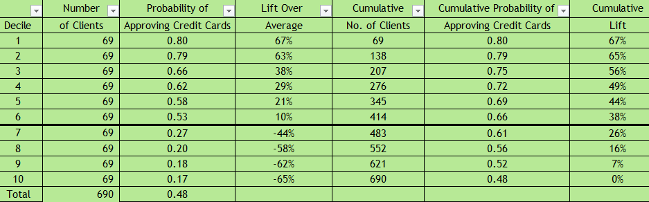

# Predicting Credit Card Approvals

   
 

## [Detailed Project Link](https://nbviewer.org/github/Emmanuel-Nti/credit_cards_approvals_prediction/blob/master/Predicting_credit_cards.ipynb)

## How We Approached the Project
- Importation of the data and libraries
- Preprocessed the data and carried out exploratory data analysis 
  - Checked for missing values and duplicates
  - Endcoded categorical columns with LabelEncoder so the machine learns better.
  - Visualized the distributtion with a Histplot
  - Checked correlation between variables
- Data Analysis
  - Build a model to pridict credit cards approval
  - Improved the model with hyperparameter tuning (using GridSearchCV)
- Conclusion and recommendations
 
## Decile Analysis
The decile analysis shows that the top 10% of customers have about 80% probability that their credit cards would be approved.
Customers in deciles 1-6 have more than 50% chance that their credit cards would be approved. 
Customers in deciles 7-10 have less than 50 % chance of getting their credit cards approved.

   
 

 
## General Findings
- More than 50% of credit card applications get approved.
- Males apply for credit cards more than females.
- The most credit card applicants are between age 20 and 40. This age group also has more credit card approvals than the other age groups.
- Applicants aged above 60 years are the least to apply for credit cards and the ones who are less likely to have their credit cards approved.
- The smaller a customer's debt, the higher the chances of a credit card approval.
- The model has about 88% accuracy of predicting a credit card approval.
- Top 10% of customers have about 80% probability that their credit cards would be approved.
- Customers in deciles 1-6 have more than 50% chance that their credit cards would be approved.
- Customers in deciles 7-10 have less than 50 % chance of getting their credit cards approved.

## Recommendations
- Approve credit cards of customers in deciles 1-6.
- Do not approve the credit cards of customers in deciles 7-10.

## Libraries Used
- Pandas 
- Numpy 
- matplotlib
- Scikit-learn 
- Scikit-plot
- Seaborn  
